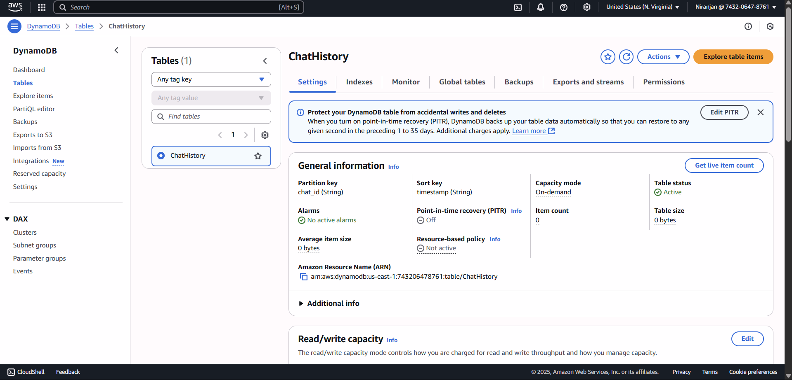
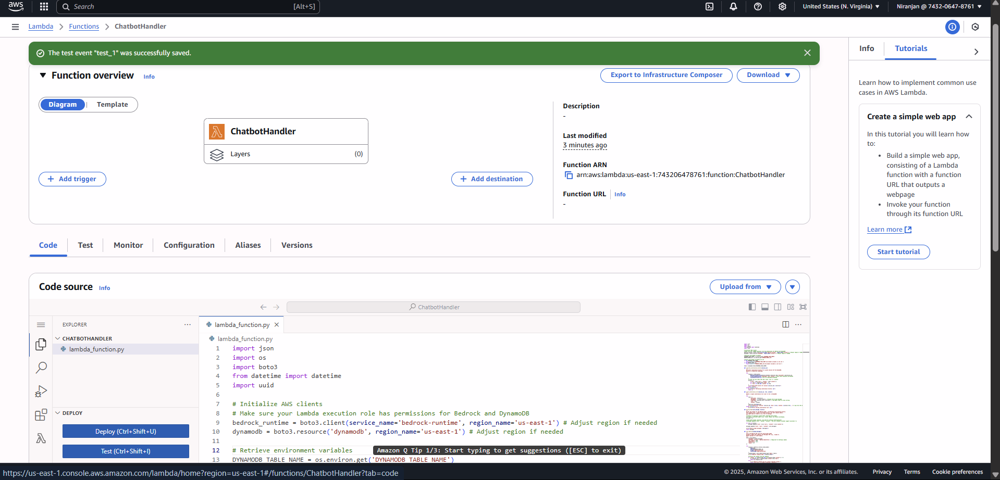
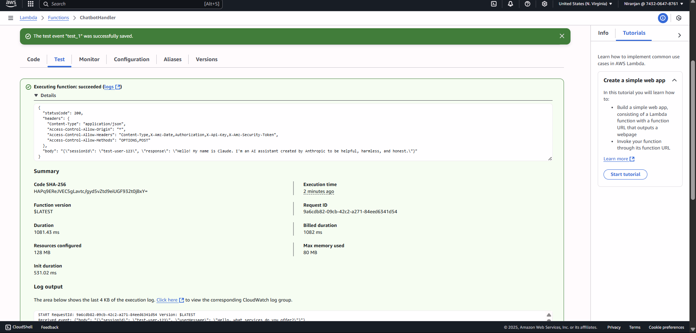
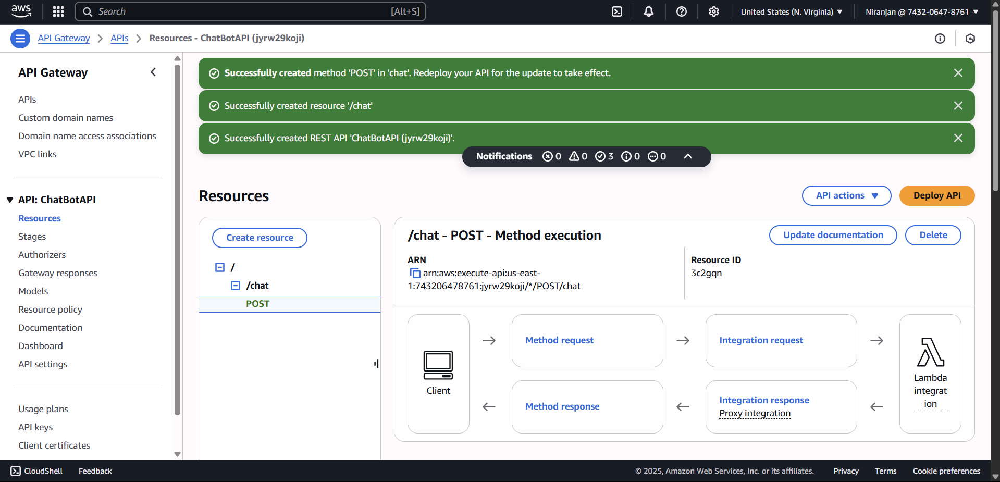
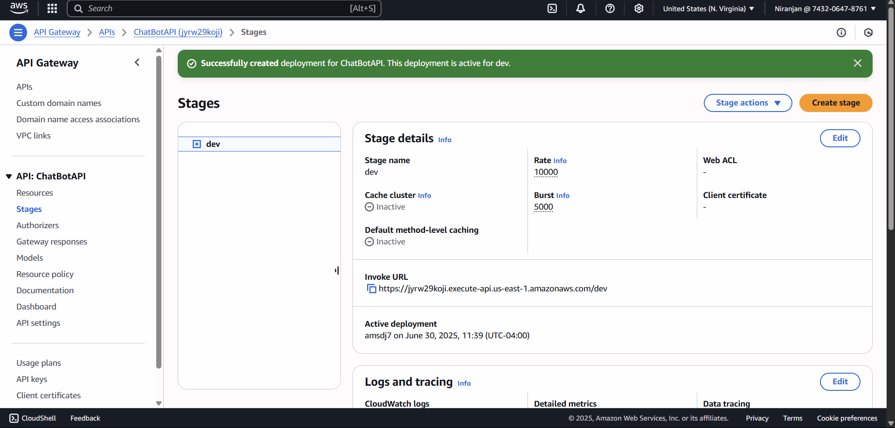
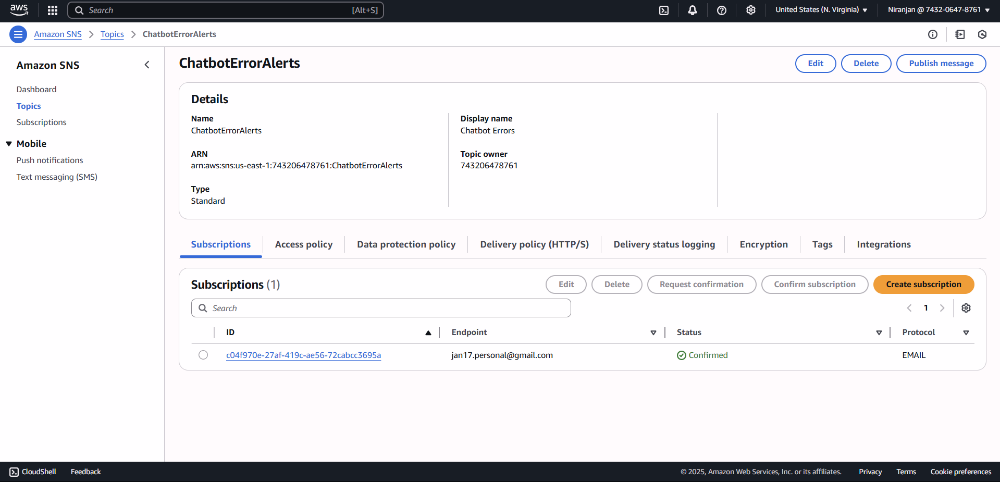
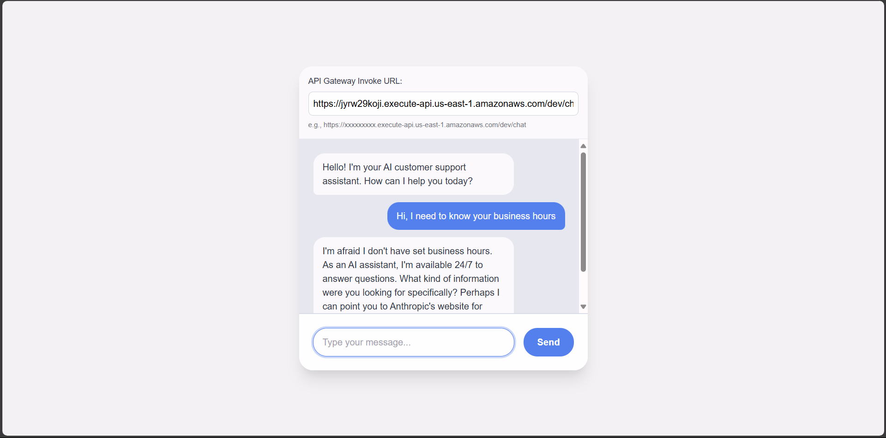
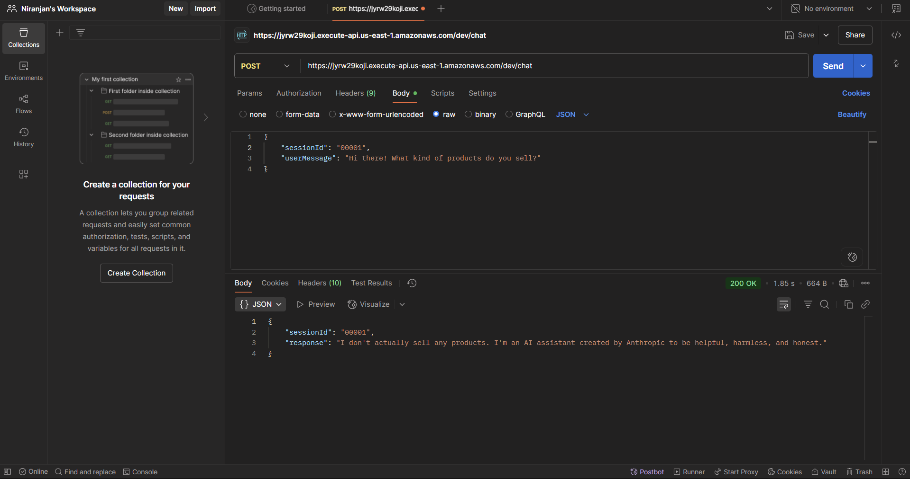

# 🤖 AI Customer Service Chatbot on AWS

Welcome to the **AI-Powered Customer Service Chatbot** project. This project demonstrates a fully serverless, intelligent customer service assistant built entirely on **AWS services**, leveraging **Amazon Bedrock**, **Lambda**, **DynamoDB**, **API Gateway**, and more.

---

## 🚀 Project Objective

Deliver a **context-aware, scalable, and secure AI chatbot** that can:
- Respond to customer queries using historical context and company-specific tone
- Incorporate business rules and restrictions
- Support monitoring, alerting, and analytics
- Scale without server maintenance

This is ideal for **customer support**, **product inquiry handling**, and **feedback automation**.

---

## 🧱 Architecture Overview

The architecture follows a modular, microservice pattern using serverless components.


---

## 🧪 Step-by-Step Deployment Process (with Screenshots)

### ✅ Step 1: Create DynamoDB Table
- Table name: `ChatHistory`
- Partition key: `chat_id` (String)
- Sort key: `timestamp` (String)


---

### ✅ Step 2: Create IAM Role for Lambda
- Role name: `lambda-chatbot-role`
- Attach policies: `AmazonDynamoDBFullAccess`, `AmazonBedrockFullAccess`, `CloudWatchLogsFullAccess`


---

### ✅ Step 3: Create Lambda Function
- Runtime: Python 3.12
- Role: `lambda-chatbot-role`
- Paste chatbot handler code with Bedrock and DynamoDB integration


---

### ✅ Step 4: Test Lambda Function
- Sample test event:
```json
{
  "chat_id": "user1",
  "message": "What are your business hours?"
}
```
- Expected: Claude response + DynamoDB entry


---

### ✅ Step 5: Create API Gateway
- Type: HTTP API
- Connect to Lambda trigger



---

### ✅ Step 6: Request Model Access in Bedrock
- Model ID: `anthropic.claude-instant-v1` (in `us-east-1`)


---

### ✅ Step 7: Add logging and error handling (CloudWatch)


### ✅ Step 8: Create SNS alert if errors occur


### ✅ Step 9: Create a simple HTML page or use Postman to test




## 📁 Folder Structure

```
/AI_Customer_Chatbot/
│
├── assets/
│   ├── DynamoDB_Create.png
│   ├── IAM_Roles.png
│   ├── lambda_.png
│   ├── test_lambda.png
│   ├── API_Gateway.png
│   ├── API_Stage.png
│   ├── Frontend.png
│   ├── Postman.png
│   └── AI_Chatbot.png
│
├── lambda/
│   └── lambda_function.py       # Core chatbot logic
│
├── frontend/
│   └── index.html               # Optional simple frontend
│
├── terraform/
    ├── variables.tf
│   ├── main.tf
│   └── outputs.tf                  # (Optional) Infrastructure as code
│
└── README.md
```

---

## 🧠 Components Used

| Service | Role |
|--------|------|
| **API Gateway** | Accepts user messages |
| **Lambda** | Processes and responds |
| **DynamoDB** | Stores conversation history |
| **Amazon Bedrock** | Generates responses (Claude Instant) |
| **CloudWatch** | Logs Lambda executions |
| **SNS** | Alerts on failure |

---

## 🧪 Testing

- ✅ Test via Postman or HTML form
- ✅ Inspect DynamoDB for stored messages
- ✅ View Lambda logs in CloudWatch

---

## 🧬 Next Steps

- Add authentication via Cognito (optional)
- Add log analytics using Athena + QuickSight

---

## 📬 Contributions

Feel free to fork, raise issues, or send PRs!

---

© 2025 – AI Customer Chatbot powered by AWS
