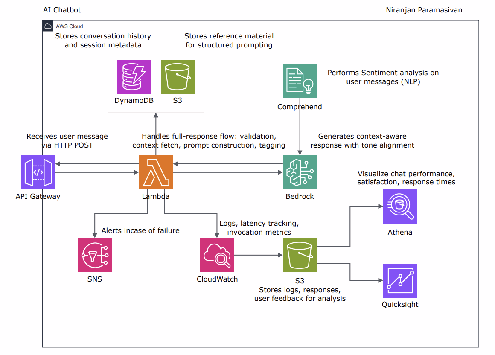

# 🤖 AI Customer Service Chatbot on AWS

Welcome to the **AI-Powered Customer Service Chatbot** project. This project demonstrates a fully serverless, intelligent customer service assistant built entirely on **AWS services**, leveraging **Amazon Bedrock**, **Lambda**, **DynamoDB**, **API Gateway**, and more.

---

## 🚀 Project Objective

Deliver a **context-aware, scalable, and secure AI chatbot** that can:

- Respond to customer queries using historical context and company-specific tone
- Incorporate business rules and restrictions
- Support monitoring, alerting, and analytics
- Scale without server maintenance

This is ideal for **customer support**, **product inquiry handling**, and **feedback automation**.

---

## 🧱 Architecture Overview

The architecture follows a modular, microservice pattern using serverless components.


### 🔁 Core Workflow

1. **User sends message** via API Gateway.
2. **Lambda** orchestrates the workflow:
   - Validates input
   - Pulls conversation history from **DynamoDB**
   - Fetches company tone & rules from **S3**
   - Constructs a rich prompt
   - Sends prompt to **Amazon Bedrock**
   - Validates and tags the response
   - Stores the interaction
3. **SNS** triggers alerts for failures or policy violations.
4. **CloudWatch** and **QuickSight** monitor behavior and trends.

---

## 🗂️ Architecture Components

### ✅ Core Services

| Service | Role |
|--------|------|
| **API Gateway** | Entry point for user messages |
| **Lambda** | Central logic handler |
| **DynamoDB** | Stores chat history |
| **Amazon S3** | Holds tone guidelines, business rules |
| **Amazon Bedrock** | Foundation model (Claude/Command etc.) for response generation |
| **Amazon CloudWatch** | Logs, metrics, and alarms |
| **Amazon SNS** | Failure and abuse notifications |
| **Amazon QuickSight** | BI and analytics for usage trends |
| **Amazon Comprehend** *(optional)* | Sentiment & entity analysis |
| **Amazon Cognito** *(optional)* | Secure user identity management |

---

## 🔄 Step-by-Step Chatbot Flow

### 1. Message Received

- User sends a message via HTTP POST to **API Gateway**.
- Message is passed to **Lambda** function for processing.

### 2. Context Retrieval

- Lambda queries **DynamoDB** for historical messages related to the session.
- Retrieves **tone guidelines** and **business rules** from **S3**.

### 3. Prompt Construction

- Lambda creates a structured prompt using:
  - Customer question
  - Relevant chat history
  - Company voice/tone
  - Legal/compliance rules

### 4. Bedrock Inference

- Prompt is sent to **Amazon Bedrock**.
- A foundation model (e.g., Claude, Titan) generates a relevant, rule-aligned response.

### 5. Post-Processing

- Lambda reviews the response.
- Flags any inappropriate or policy-violating answers.
- Tags conversation for analytics (e.g., topic, intent, escalation needs).

### 6. Output

- Final response is returned to **API Gateway** → delivered to the user.
- Full conversation is logged back to **DynamoDB**.

---

## 🧠 Optional Enhancements

- **Comprehend**: Analyze tone or intent before Bedrock call.
- **SQS + DLQ**: Queue messages during peak traffic or failures.
- **Step Functions**: Break large logic into multi-step orchestration.
- **Cognito**: Handle secure login and token-based sessions.
- **Athena + S3**: Enable SQL queries over chat logs.

---

## 🔒 Security and Compliance

- **IAM Roles**: Scoped least-privilege roles for Lambda, Bedrock, S3.
- **KMS Encryption**: For secure storage of chat logs and user info.
- **Audit Trails**: CloudTrail + S3 logging for compliance visibility.

---

## 📊 Observability & Analytics

- **CloudWatch**:
  - Log every Lambda invocation
  - Track errors and latency
- **S3 + Athena**:
  - Store structured logs
  - Query with SQL for trends and summaries
- **QuickSight**:
  - Build dashboards for usage, satisfaction, resolution rates

---

<!--## 📁 Repository Structure

```
/ai-chatbot/
│
├── lambda/
│   └── orchestrator.py        # Main chat logic
├── prompts/
│   └── tone-guidelines.txt    # Company tone definitions
│   └── rules.json             # Business logic
├── assets/
│   └── architecture.png       # System diagram
├── README.md
```
-->

---

## 🧪 Testing & Validation

- Simulate conversations via Postman or frontend
- Validate context awareness, tone consistency, rule enforcement
- Test failure scenarios (e.g., missing rules, no history, Bedrock timeout)
- Trigger alert via SNS for invalid outputs

---

## 📬 Contributions

Feel free to fork, raise issues, or send PRs! This project aims to evolve into a robust support framework.

---

© 2025 – AI Customer Chatbot powered by AWS
